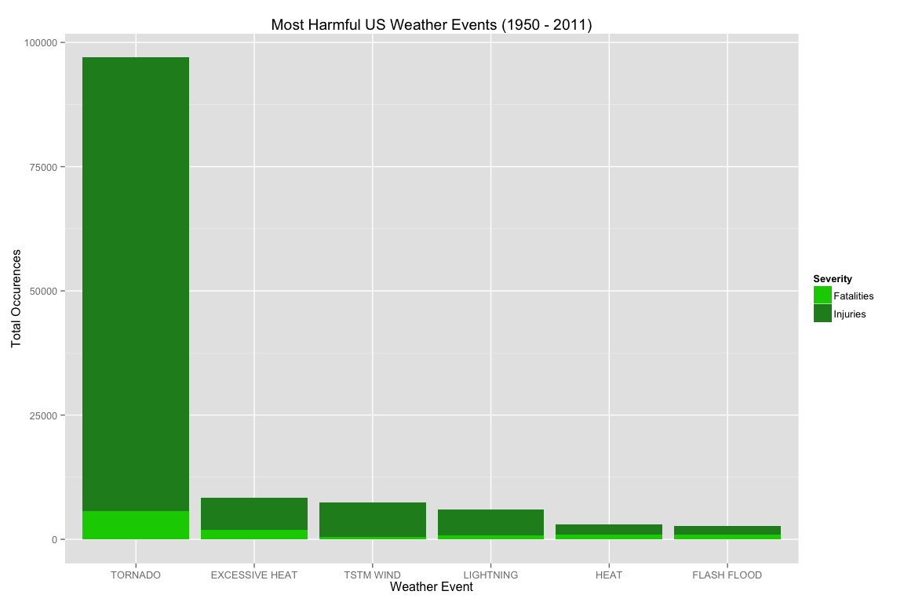
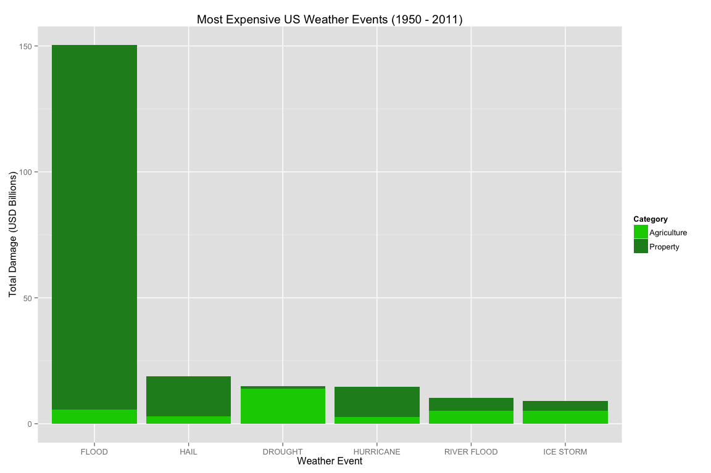

# Levels Of Harm and Economic Damage from US Weather Events
Matt Narrell  
February 22, 2015  


## Synopsis
This data analysis examines the level of harm and damage of weather events in the United States between the the years of 1950 and 2011.  The data are from the U.S. National Oceanic and Atmospheric Administration's (NOAA) storm database. This database tracks characteristics of major storms and weather events in the United States, including when and where they occur, as well as estimates of any fatalities, injuries, and property damage.

Supplemental information on this data set can be found here:

* National Weather Service [Storm Data Documentation](https://d396qusza40orc.cloudfront.net/repdata%2Fpeer2_doc%2Fpd01016005curr.pdf)
* National Climatic Data Center Storm Events [FAQ](https://d396qusza40orc.cloudfront.net/repdata%2Fpeer2_doc%2FNCDC%20Storm%20Events-FAQ%20Page.pdf)

This data analysis will answer the following:

1. Across the United States, which types of events are most harmful with respect to population health?
2. Across the United States, which types of events have the greatest economic consequences?

## Environment

```r
library("dplyr")
library("reshape2")
library("ggplot2")

sessionInfo()
```

```
## R version 3.1.2 (2014-10-31)
## Platform: x86_64-apple-darwin13.4.0 (64-bit)
## 
## locale:
## [1] en_US.UTF-8/en_US.UTF-8/en_US.UTF-8/C/en_US.UTF-8/en_US.UTF-8
## 
## attached base packages:
## [1] stats     graphics  grDevices utils     datasets  methods   base     
## 
## other attached packages:
## [1] ggplot2_1.0.0  reshape2_1.4.1 dplyr_0.4.1   
## 
## loaded via a namespace (and not attached):
##  [1] assertthat_0.1   colorspace_1.2-4 DBI_0.3.1        digest_0.6.8    
##  [5] evaluate_0.5.5   formatR_1.0      grid_3.1.2       gtable_0.1.2    
##  [9] htmltools_0.2.6  knitr_1.9        magrittr_1.5     MASS_7.3-37     
## [13] munsell_0.4.2    packrat_0.4.3    parallel_3.1.2   plyr_1.8.1      
## [17] proto_0.3-10     Rcpp_0.11.4      rmarkdown_0.5.1  scales_0.2.4    
## [21] stringr_0.6.2    tools_3.1.2      yaml_2.1.13
```
## Data Processing
### Obtaining the data
The data are downloaded from [here](https://d396qusza40orc.cloudfront.net/repdata%2Fdata%2FStormData.csv.bz2).  A timestamp of when the data are fetched is written for completeness.

```r
local.data.archive <- "./data/StormData.csv.bz2"
dir.create("./data", showWarnings = FALSE)
dataSrcUri <- "https://d396qusza40orc.cloudfront.net/repdata%2Fdata%2FStormData.csv.bz2"
download.file(dataSrcUri, local.data.archive, "curl")

conn <- file("./data/data_fetch_timestamp.txt")
timestamp <- paste("StormData downloaded from", dataSrcUri, "at", Sys.time())
writeLines(timestamp, conn)
close(conn)

storm.data <- tbl_df(read.csv(bzfile("./data/StormData.csv.bz2"), stringsAsFactors = FALSE, na.strings = ""))
```
StormData downloaded from https://d396qusza40orc.cloudfront.net/repdata%2Fdata%2FStormData.csv.bz2 at 2015-02-22 11:39:07

Some initial examination:

```r
str(storm.data)
```

```
## Classes 'tbl_df', 'tbl' and 'data.frame':	902297 obs. of  37 variables:
##  $ STATE__   : num  1 1 1 1 1 1 1 1 1 1 ...
##  $ BGN_DATE  : chr  "4/18/1950 0:00:00" "4/18/1950 0:00:00" "2/20/1951 0:00:00" "6/8/1951 0:00:00" ...
##  $ BGN_TIME  : chr  "0130" "0145" "1600" "0900" ...
##  $ TIME_ZONE : chr  "CST" "CST" "CST" "CST" ...
##  $ COUNTY    : num  97 3 57 89 43 77 9 123 125 57 ...
##  $ COUNTYNAME: chr  "MOBILE" "BALDWIN" "FAYETTE" "MADISON" ...
##  $ STATE     : chr  "AL" "AL" "AL" "AL" ...
##  $ EVTYPE    : chr  "TORNADO" "TORNADO" "TORNADO" "TORNADO" ...
##  $ BGN_RANGE : num  0 0 0 0 0 0 0 0 0 0 ...
##  $ BGN_AZI   : chr  NA NA NA NA ...
##  $ BGN_LOCATI: chr  NA NA NA NA ...
##  $ END_DATE  : chr  NA NA NA NA ...
##  $ END_TIME  : chr  NA NA NA NA ...
##  $ COUNTY_END: num  0 0 0 0 0 0 0 0 0 0 ...
##  $ COUNTYENDN: logi  NA NA NA NA NA NA ...
##  $ END_RANGE : num  0 0 0 0 0 0 0 0 0 0 ...
##  $ END_AZI   : chr  NA NA NA NA ...
##  $ END_LOCATI: chr  NA NA NA NA ...
##  $ LENGTH    : num  14 2 0.1 0 0 1.5 1.5 0 3.3 2.3 ...
##  $ WIDTH     : num  100 150 123 100 150 177 33 33 100 100 ...
##  $ F         : int  3 2 2 2 2 2 2 1 3 3 ...
##  $ MAG       : num  0 0 0 0 0 0 0 0 0 0 ...
##  $ FATALITIES: num  0 0 0 0 0 0 0 0 1 0 ...
##  $ INJURIES  : num  15 0 2 2 2 6 1 0 14 0 ...
##  $ PROPDMG   : num  25 2.5 25 2.5 2.5 2.5 2.5 2.5 25 25 ...
##  $ PROPDMGEXP: chr  "K" "K" "K" "K" ...
##  $ CROPDMG   : num  0 0 0 0 0 0 0 0 0 0 ...
##  $ CROPDMGEXP: chr  NA NA NA NA ...
##  $ WFO       : chr  NA NA NA NA ...
##  $ STATEOFFIC: chr  NA NA NA NA ...
##  $ ZONENAMES : chr  NA NA NA NA ...
##  $ LATITUDE  : num  3040 3042 3340 3458 3412 ...
##  $ LONGITUDE : num  8812 8755 8742 8626 8642 ...
##  $ LATITUDE_E: num  3051 0 0 0 0 ...
##  $ LONGITUDE_: num  8806 0 0 0 0 ...
##  $ REMARKS   : chr  NA NA NA NA ...
##  $ REFNUM    : num  1 2 3 4 5 6 7 8 9 10 ...
```

```r
unique(storm.data$PROPDMGEXP)
```

```
##  [1] "K" "M" NA  "B" "m" "+" "0" "5" "6" "?" "4" "2" "3" "h" "7" "H" "-"
## [18] "1" "8"
```

```r
unique(storm.data$CROPDMGEXP)
```

```
## [1] NA  "M" "K" "m" "B" "?" "0" "k" "2"
```
The values for fatalities and injuries do not need adjustment.  The property and crop monetary values are expressed as a value and an exponent.  These exponent variables will need to be cleaned.

### Cleaning the data
This function will normalize the SI unit symbol of the exponent to its base ten value.  Any missing or unmatched values will be discarded.  The value is converted to a numeric for later calculation

```r
format.exponent <- function(exp) {
  exp[is.na(exp)] = "0"
  exp <- gsub("h|H", "2", exp)
  exp <- gsub("k|K", "3", exp)
  exp <- gsub("m|M", "6", exp)
  exp <- gsub("b|B", "9", exp)
  exp <- gsub("\\+|\\?|\\-", "0", exp)
  as.numeric(exp)
  }

unique(sapply(storm.data$PROPDMGEXP, format.exponent))
```

```
##  [1] 3 6 0 9 5 4 2 7 1 8
```

```r
unique(sapply(storm.data$CROPDMGEXP, format.exponent))
```

```
## [1] 0 6 3 9 2
```

The exponents are formatted, and applied to their USD base values.  The **EVTYPE**, **FATALITIES** and **INJURIES** values are taken 'as-is'.

```r
cleaned.storm.data <- storm.data %>% 
  mutate(prop.dmg.exp = sapply(PROPDMGEXP, format.exponent), 
         prop.dmg = PROPDMG * (10^prop.dmg.exp), 
         crop.dmg.exp = sapply(CROPDMGEXP, format.exponent), 
         crop.dmg = CROPDMG * (10^crop.dmg.exp)) %>% 
  select(event.type = EVTYPE, fatalities = FATALITIES, injuries = INJURIES, prop.dmg, crop.dmg)  
```
The resulting exponents are cleaned, and only the interesting variables to this analysis are selected.

```r
str(cleaned.storm.data)
```

```
## Classes 'tbl_df', 'tbl' and 'data.frame':	902297 obs. of  5 variables:
##  $ event.type: chr  "TORNADO" "TORNADO" "TORNADO" "TORNADO" ...
##  $ fatalities: num  0 0 0 0 0 0 0 0 1 0 ...
##  $ injuries  : num  15 0 2 2 2 6 1 0 14 0 ...
##  $ prop.dmg  : Named num  25000 2500 25000 2500 2500 2500 2500 2500 25000 25000 ...
##   ..- attr(*, "names")= chr  "K" "K" "K" "K" ...
##  $ crop.dmg  : Named num  0 0 0 0 0 0 0 0 0 0 ...
##   ..- attr(*, "names")= chr  NA NA NA NA ...
```

```r
remove(storm.data)
```
## Results
### Question 1: Across the United States, which types of events are most harmful with respect to population health?

```r
harmful.events <- cleaned.storm.data %>% 
  group_by(event.type) %>%
  summarize(Fatalities = sum(fatalities), 
            Injuries = sum(injuries)) %>% 
  arrange(desc(Fatalities, Injuries))

harmful.events <- melt(head(harmful.events), id.vars = "event.type", variable.name = "Severity")

harmful.events.plot <- ggplot(harmful.events, aes(reorder(event.type, -value), y = value, fill = Severity)) + 
  geom_bar(stat = "identity", position = "stack") + 
  scale_fill_manual(values = c("green3", "forestgreen")) +  
  xlab("Weather Event") + 
  ylab("Total Occurences") + 
  ggtitle("Most Harmful US Weather Events (1950 - 2011)")
  
print(harmful.events.plot)
```

 
The tornado is by far the most harmful US weather event.  Injuries vastly outnumber fatalities in most cases.

### Question 2: Across the United States, which types of events have the greatest economic consequences?

```r
expensive.events <- cleaned.storm.data %>% 
  group_by(event.type) %>%
  summarize(Agriculture = sum(crop.dmg)/10^9, Property = sum(prop.dmg)/10^9) %>% 
  arrange(desc(Agriculture, Property))

expensive.events <- melt(head(expensive.events), id.vars = "event.type", variable.name = "Category")

expensive.events.plot <- ggplot(expensive.events, 
                                aes(reorder(event.type, -value), y = value, fill = Category)) + 
  geom_bar(stat = "identity", position = "stack") + 
  scale_fill_manual(values = c("green3", "forestgreen")) + 
  xlab("Weather Event") + 
  ylab("Total Damage (USD Billions)") + 
  ggtitle("Most Expensive US Weather Events (1950 - 2011)")

print(expensive.events.plot) 
```

 
Flooding has the greatest property damage while drought damages the most agriculture.
